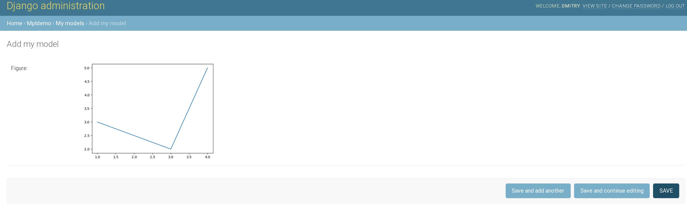

.. Django Matplotlib documentation master file, created by
   sphinx-quickstart on Tue Oct 22 16:13:43 2019.
   You can adapt this file completely to your liking, but it should at least
   contain the root `toctree` directive.

.. |---| unicode:: U+2014  .. em dash

.. |--| unicode:: U+2013   .. en dash

Welcome to Django Matplotlib's documentation!
*********************************************

Matplotlib is a widely used package for generating
publication ready figures for science and technology.

This Django application aims at integration Matplotlib and Django 
to simplify process of embedding matplotlib figures to Django driven
web sites, including Django admin app.

Quick start
===========

Requirements
------------

You need to install matplotlib package to use Django maptlotlib.

Django matplotlib is tested with Django 1.11+ |--| 2.2 and Python 3.5+, <3.8.

Installation
------------

Install Django matplotlib::

    pip install django_matplotlib

Add `django_matplotlib` to INSTALLED_APPS::

    INSTALLED_APPS = [
                ...
                'django_matplotlib',
                # it doens't matter where it is placed
                ...
    ]

Minimal configuration
---------------------

.. code-block:: python

    # -----------
    # models.py
    # -----------

    from django.db import models
    from django_matplotlib import 

    class MyModel(models.Model):
        figure = MatplotlibFigureField(figure='my_figure')

    # -----------
    # figures.py lives in the same folder as models.py
    # -----------

    import matplotlib.pyplot as plt

    def my_figure():
        fig, ax = plt.subplots()
        ax.plot([1, 3, 4], [3, 2, 5])
        return fig

    # --------
    # admin.py
    # --------

    from django.contrib import admin
    from .models import MyModel

    admin.site.register(MyModel)

If everything is configured in a right way,
you should get something like this in your admin:

Detailed information about field's configuration parameters
is available :doc:`Здесь<main>`.

.. seealso::

    `Example project <http://github.com/scidam/django_matplotlib/example>`_

Contents
========

.. toctree::
    :maxdepth: 2

    main
    fullconf
    samplefig

Indices and tables
==================

* :ref:`genindex`
* :ref:`search`

